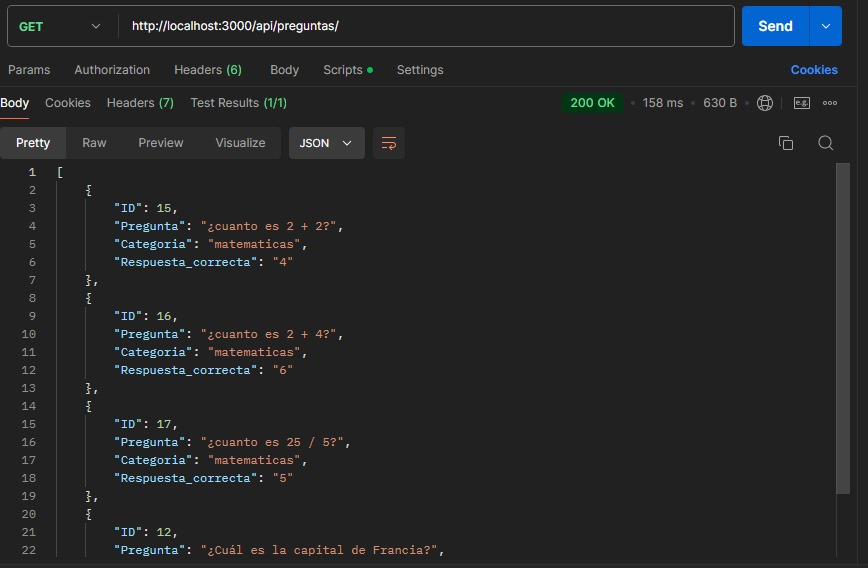
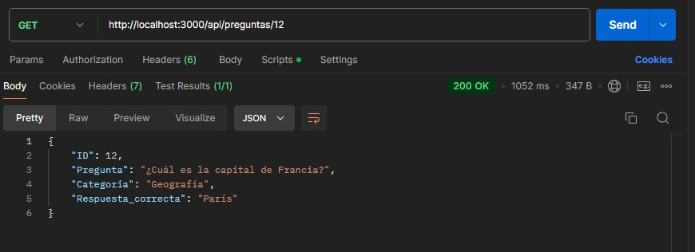
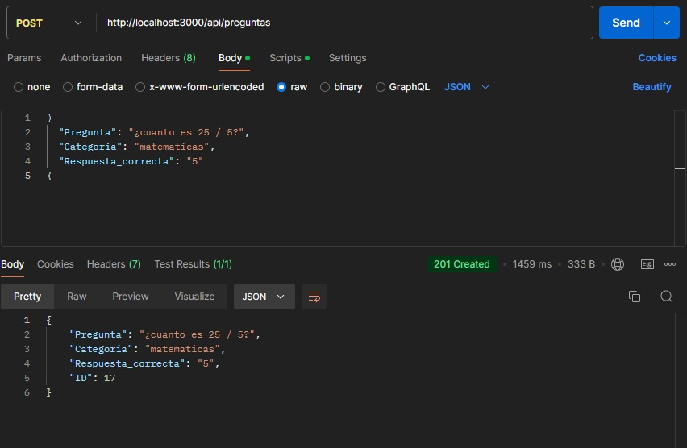
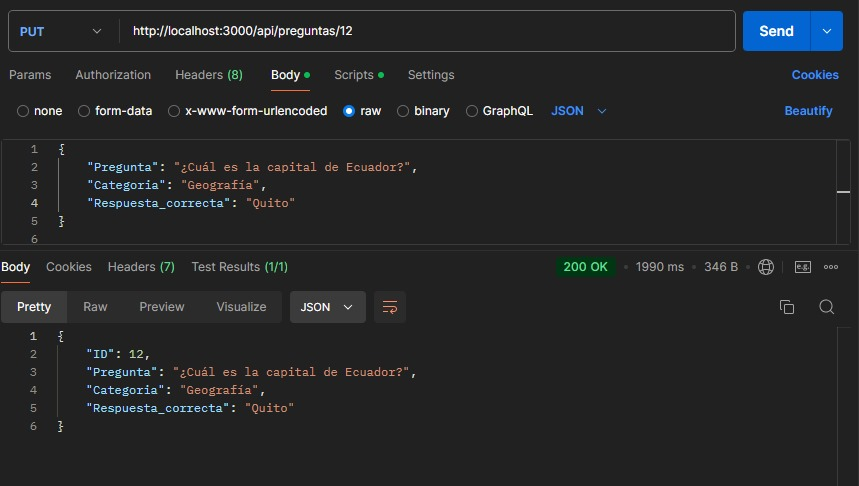
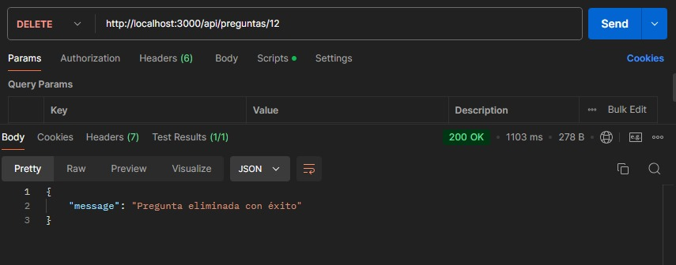

# Awesome Project Build with TypeORM

Steps to run this project:

1. Run `npm i` command
2. Setup database settings inside `data-source.ts` file
3. Run `npm start` command

## Practicas de servicios rest en postman

## Metodo Get general

## Metodo Get individual

## Metodo Post

## Metodo Put/Patch

## Metodo Delete

